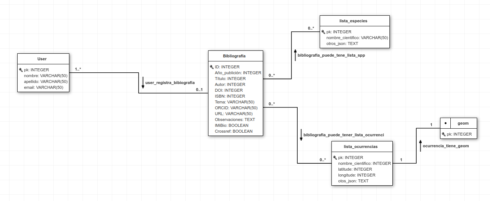

# Bibliography app

## Publicaciones

La app `bibliography` hace parte del sistema de gestión de conocimiento del IMiBio. Fue creada para registrar informaciones al respecto de libros, artículos u otros tipos de publicaciones, principalmente científicas. 
Los datos cargados en el formulário, pasa por un proceso de [validación y limpieza](#validadores-y-limpieza), con el objetivo de garantizar la consistencia de los datos cargados.
Además, la app posee la capacidad de rescatar información oficial de las publicaciones que tienen [DOI (Digital Object Identification)](https://www.doi.org/) o [ISBN (International Standard Book)](https://www.isbn.org.ar/). Aquellas publicaciones que no poseen DOI ni ISBN, podrán ser cargadas siendo necesário que el usuário registre todas las informaciones obligatórias de manera manual, es decir: `título`, `autor` y `año de publicación`. **En dichos casos, el sistema no aceptará registro de publicaciones sin estas informaciones.**

El campo *booleano* `crossref`, que posee valor por defecto `True` sirve para indicar cuando la publicación posee `DOI` o `ISBN`, sendo usada como um indicador para el uso de las [APIs de rescate de metadatos](#apis).

Trás el registro de la publicación el usuário podrá editar los campos, y tambien añadir una [lista de especies](#lista-de-especies) y [lista de ocurrencias](#lista-de-ocurrencias) relacionada a la publicacion, si hace falta.

## Lista de especies y Lista de ocurrencias

Las publicaciones cargadas podrán tener una lista de especies y/o una lista de ocurrencias, las cuales deberán ser cargadas en formato `.csv` (comma separated values).

### Lista de especies

Se trata de una lista de nombres científicos de biodiversidad, podendo tener otras infomraciones asociadas (columnas). Se requiere que la primera columna sea la información de nombre científico de especies y que el nombre de la columna sea `scientific_name`. Caso la lista presente su primera columna con otro nombre, un error generado y los datos **no serán cargados**.

### Lista de ocurrencias

Se trata de una lista de nombres científicos de biodiversidad que, a distinción de la [lista de espécies](#lista-de-especies), poseen, además del nombre científico (como primer columna y nomeada como `scientific_name`), dos columnas informando la `latitud` y `longitud`, ambas en grados decimales ([más infos, aqui](https://acolita.com/grados-minutos-segundos-dms-vs-grados-decimales-dd/)). El nombre de dichas columnas deberán ser, obligatoriamente: `longitude` y `latitude`, siguiendo el orden: `scientific_name`, `latitude` y `longitude`.
Tal cual como en las listas de especies, otras columnas podrán existir y serán almacenadas en la base de datos.

## APIs

La app usa API´S de [Crossrefapi](https://www.crossref.org/blog/python-and-ruby-libraries-for-accessing-the-crossref-api/) y [isbnlib](https://pypi.org/project/isbnlib/), para rescatar los metadatos de `DOI` y `ISBN`, respectivamente.
 
### Validadores y limpieza

* [`validate_isbn`](sysimibio/bibliography/validators.py): Es usado para validar el campo [`ISBN`](sysimibio/bibliography/validators.py#l4), confirmando que el valor ingresado tenga 10 o 13 dígitos. Caso contrário retorna un `ValidationError`. El campo DOI también pasa por validación ya que [si o si empiezan con el valor '10'](sysimibio/bibliography/validators.py#l9) y [deben poseen "/"](sysimibio/bibliography/validators.py#l14);  
* En el método de limpieza del formulario del `PublicationForm` ([`clean()`](sysimibio/bibliography/forms.py#l15)):  
    *  se hace la [confirmación de la existencia de un valor de `DOI` o `ISBN` y `crossref` habilitado (`True`)](sysimibio/bibliography/forms.py#l24). Caso contrário, retorna `ValidationError`.  
    * se hace la [confirmarción de la existéncia de valores para `título`, `autor` y `año de publicación` para cuando el `crossref` este deshabilitado (`False`)]((sysimibio/bibliography/forms.py#l29). Caso contrário, retorna `ValidationError`.  
* En el método [`clean_ISBN`](sysimibio/bibliography/forms.py#l35) de `PublicationForm`:  
    * Se hace un proceso de limpieza de los valores ingresados de `ISBN`:  
        * se excluyen los guiones y puntos;  
        * se convierte `ISBN` de 10 caracteres para 13, usando `isblib`;
* En el método [`clean_DOI`](sysimibio/bibliography/forms.py#l47) de `PublicationForm`:  
    * Se hace la remoción de "/" caso la misma haya sido pasada al final del DOI; 
* En la clase [`UploadSpeciesListForm`](sysimibio/bibliography/forms.py#l54) y [`UploadOccurrencesListForm`](sysimibio/bibliography/forms.py#l67):
    * Se excluyen los archivos que **no sean formato .csv** mediante la extensión `FileExtensionValidator`;  
* En las *views* [`SpeciesListCreateClass`](sysimibio/bibliography/views.py#l151) y [`OccurrenceListCreateClass`](sysimibio/bibliography/views.py#l190) se utilizan las funciones [`handle_uploaded_species_list_file`](sysimibio/bibliography/views.py#l109) y [`handle_uploaded_ocurrences_list_file`](sysimibio/bibliography/views.py#l128) para validar la existencia de las columnas `scientific_name` y `scientific_name`, `longitude` y `latitude`, respectivamente. Los archivos que se intenten subir sin dichos requerimientos retornarán errores.

## Base de datos: entidades e relacionamentos da app  

  
