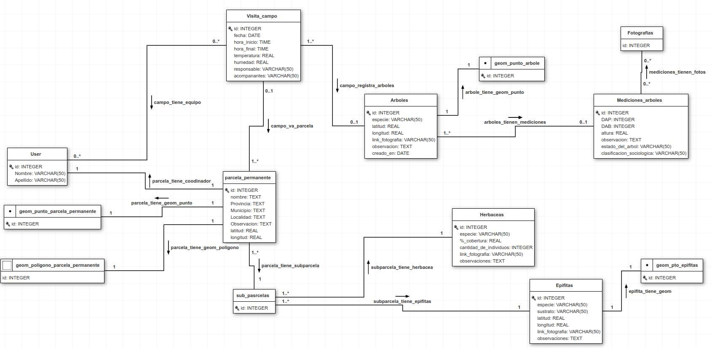

# Sistema de gestión de datos de Parcelas Permanentes de Investigación (PPI)

La aplicación `PPI` hace parte del sistema de gestión de datos y conocimientos ambientales y de biodiversidad del IMIBIO. Fue creada para almacenar y gestionar los datos relacionados a las percelas permanentes de investigación.

La aplicación está dividida en cuatro componentes:  
1. Registro de parcela permanente de investigación, donde se cargan los datos al respecto de la parcela, como su ubicación (inclusive en fomrato de dato geográfico), tipo de parcela catastral y el responsable (coordinador);
2. Registro de visitas de campo a la parcela ya registrada agregando datos como fecha, hora de início y fin de la misma, coordinador del campo, asistentes, temperatura y humedad;
3. Registro de Árboles,que se asocia a una visita de campo y, luego, a una parcela. Se registran latitud, longitud, numero del arbol y nombre de la especie.
4. Por ultimo se registran la mediciones, relacionadas a los árboles: DAB, DAP, estatus fitosanitario, clasificación sociológica, cantidad de lianas, etc.

### Validadores y limpieza 
* En el método [`clean()`](sysimibio/imibio_tree_ecological_data/forms.py#l27) de `XPTOForm`:
    *  se hace la confirmación de... Caso contrário, retorna `ValidationError`.

## Base de datos  
  
